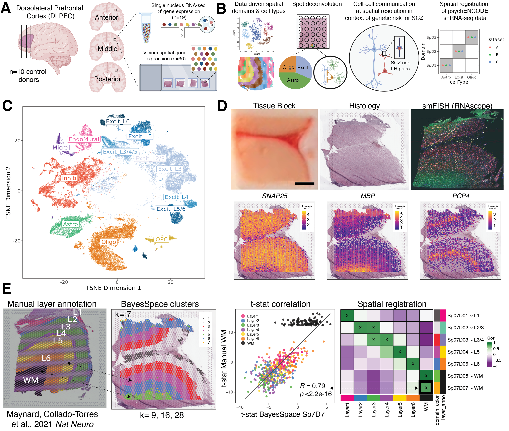

## Contents
{:.no_toc}

-   [Spatial DLPFC](#spatial-dlpfc)
    -   [Installation instructions](#installation-instructions)
    -   [Access the data](#access-the-data)
        -   [Processed data](#processed-data)
        -   [Raw data](#raw-data)
-   [Internal](#internal)
    -   [Files](#files)
    -   [Other related files](#other-related-files)
{:toc}

<!-- README.md is generated from README.Rmd. Please edit that file -->

## Spatial DLPFC

This project has the code for the project using 10X Genomics Visium for
generating spatial transcriptomics data from the dorsolateral prefrontal
cortex (DLPFC) from human brain samples. This work is being done by the
groups at the Lieber Institute for Brain Development led by Keri
Martinowich, Kristen Maynard and Leonardo Collado-Torres as well as
Stephanie Hicks from JHBSPH’s Biostatistics Department.

\#\#Study iesign

\#\#Shiny website mirrors

### Installation instructions

Get the latest stable `R` release from
[CRAN](http://cran.r-project.org/). Then install `spatialLIBD` using
from [Bioconductor](http://bioconductor.org/) the following code:

``` r
if (!requireNamespace("BiocManager", quietly = TRUE))
    install.packages("BiocManager")
BiocManager::install("spatialLIBD")
```

### Access the data

Through the `spatialLIBD` package you can access the processed data in
it’s final R format.

#### Processed data

Using `spatialLIBD` you can access the Human DLPFC spatial
transcriptomics data from the 10x Genomics Visium platform. For example,
this is the code you can use to access the spatially-resolved data. For
more details, check the help file for `fetch_data()`.

``` r

### Load the package
library("spatialLIBD")

### Download the spot-level data
spe <- fetch_data(type = "spe_spatialDLPFC") ## TODO update spatialLIBD
#> Loading objects:
#>   spe

### This is a SpatialExperiment object
spe ## TODO: update the output below
#> class: SingleCellExperiment 
#> dim: 33538 47681 
#> metadata(1): image
#> assays(2): counts logcounts
#> rownames(33538): ENSG00000243485 ENSG00000237613 ... ENSG00000277475
#>   ENSG00000268674
#> rowData names(9): source type ... gene_search is_top_hvg
#> colnames(47681): AAACAACGAATAGTTC-1 AAACAAGTATCTCCCA-1 ...
#>   TTGTTTCCATACAACT-1 TTGTTTGTGTAAATTC-1
#> colData names(73): barcode sample_name ... pseudobulk_UMAP_spatial
#>   markers_UMAP_spatial
#> reducedDimNames(6): PCA TSNE_perplexity50 ... TSNE_perplexity80
#>   UMAP_neighbors15
#> spikeNames(0):
#> altExpNames(0):

### Note the memory size
lobstr::object_size(spe) / 1024^3
#> 2.08 GB ## TODO: update this

### Remake the logo image with histology information
spatialLIBD::vis_clus(
    spe = spe,
    clustervar = "bayesSpace_harmony_9",
    sampleid = "Br2720_Ant",
    colors = libd_layer_colors, ## TODO
    ... = " spatial DLPFC Human Brain k=9\nMade with github.com/LieberInstitute/spatialLIBD"
)
```

TODO: update this:



#### Raw data

You can access all the raw data through
[Globus](http://research.libd.org/globus/) (`jhpce#spatialDLPFC`).

## Internal

*Note: the idea is to use the same structure as in the
[`locus-c`](https://github.com/lmweber/locus-c) project.*

-   JHPCE location:
    `/dcs04/lieber/lcolladotor/spatialDLPFC_LIBD4035/spatialDLPFC`.
-   Slack channel: `libd_dlpfc_spatial`.

### Files

-   `code`: scripts for running `SpaceRanger` and doing the analyses.
-   `plots`: plots generated by RMarkdown or R analysis scripts in
    `.pdf` or `.png` format
-   `processed-data`
    -   `images_spatialLIBD`: images used for running `SpaceRanger`
    -   `NextSeq`: `SpaceRanger` output files
    -   `rdata`: R objects
-   `raw-data`
    -   `FASTQ`: FASTQ files from `NextSeq` runs.
    -   `Images`: raw images from the scanner in `.tif` format and
        around 3 GB per sample.
    -   `images_raw_align_json`
    -   `sample_info`: spreadsheet with information about samples
        (sample ID, sample name, slide serial number, capture area ID)

This project is organized along the guidelines at
<https://lcolladotor.github.io/bioc_team_ds/organizing-your-work.html#.Yaf9fPHMIdk>.

### Other related files

-   reference transcriptome from 10x Genomics:
    `/dcs04/lieber/lcolladotor/annotationFiles_LIBD001/10x/refdata-gex-GRCh38-2020-A/`
